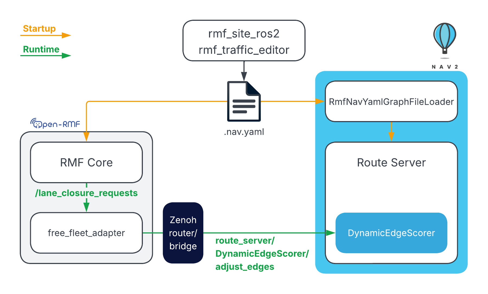

# Open-RMF ↔ Nav2 Route Sync Demo

Demo workspace for the Open-RMF ↔ Nav2 route synchronization example on ROS 2 Jazzy.

## Overview



Open-RMF and Nav2 use the same route graph. The graph is generated at build time
from an RMF site description and loaded into Nav2 on startup. At runtime, any lane
closures or reopenings issued through Open-RMF are propagated to Nav2, so both
systems always agree on which routes are available.

Nav2 is configured with the SMAC planner and the Regulated Pure Pursuit (RPP)
controller so the robot tracks the route graph closely.

## Setup

This workspace runs inside the provided devcontainer. New devcontainer terminals
automatically source ROS 2 and the workspace overlay.

**Host prerequisite:** install `zenohd` by following the
[official guide](https://zenoh.io/docs/getting-started/installation/#ubuntu-or-any-debian).

When the devcontainer is created, `./setup.sh` and `./build.sh` run automatically.
Re-run `./build.sh` inside the devcontainer after any source code changes.

## Running the Demo

Start `zenohd` on the **host machine** first, then open the devcontainer and launch
the remaining three processes each in their own devcontainer terminal.

### Host machine — zenoh router

```bash
zenohd
```

### Devcontainer — Terminal 1: Simulation

```bash
export RMW_IMPLEMENTATION=rmw_cyclonedds_cpp
ros2 launch rmf_nav2_route_demo nav2.launch.py
```

### Devcontainer — Terminal 2: zenoh bridge

```bash
export RMW_IMPLEMENTATION=rmw_cyclonedds_cpp
zenoh-bridge-ros2dds -c $(ros2 pkg prefix free_fleet_examples)/share/free_fleet_examples/config/zenoh/nav2_tb3_zenoh_bridge_ros2dds_client_config.json5
```

### Devcontainer — Terminal 3: RMF + fleet adapter

```bash
export ROS_DOMAIN_ID=55
ros2 launch rmf_nav2_route_demo rmf.launch.xml
```

## Demo Actions

Run all commands below in a **devcontainer terminal** with `ROS_DOMAIN_ID=55`. They
demonstrate that lane closures issued through RMF are propagated to Nav2, so both
systems always agree on which routes are available.

### 1. Dispatch with lanes open

With all lanes open (the default), dispatch a task. The robot traverses the corridor
through lanes `20` and `21` because it is the shortest path.

```bash
export ROS_DOMAIN_ID=55
ros2 run rmf_demos_tasks dispatch_go_to_place -p north_east
```

### 2. Close lanes

Close lanes `20` and `21`. Both RMF and the Nav2 route server will treat that
corridor as unavailable.

```bash
export ROS_DOMAIN_ID=55
ros2 topic pub --once /lane_closure_requests rmf_fleet_msgs/msg/LaneRequest \
	"{fleet_name: 'turtlebot3', close_lanes: [20, 21], open_lanes: []}"
```

### 3. Return to start with lanes closed

Send the robot back to its starting position. Because lanes `20` and `21` are now
closed, the robot cannot retrace the path it took to reach `north_east` and will use
an alternate route instead.

```bash
export ROS_DOMAIN_ID=55
ros2 run rmf_demos_tasks dispatch_go_to_place -p tb3_charger
```

### 4. Reopen lanes

Reopen the corridor. Subsequent RMF dispatches and Nav2 graph-based goals can use
that route again.

```bash
export ROS_DOMAIN_ID=55
ros2 topic pub --once /lane_closure_requests rmf_fleet_msgs/msg/LaneRequest \
	"{fleet_name: 'turtlebot3', close_lanes: [], open_lanes: [20, 21]}"
```

## License

This project is licensed under the Apache License 2.0. See [LICENSE](LICENSE) for details.